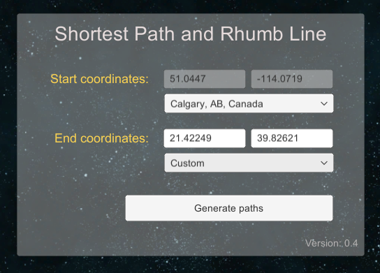
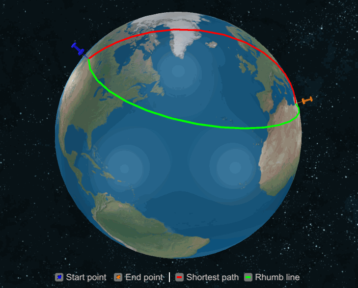
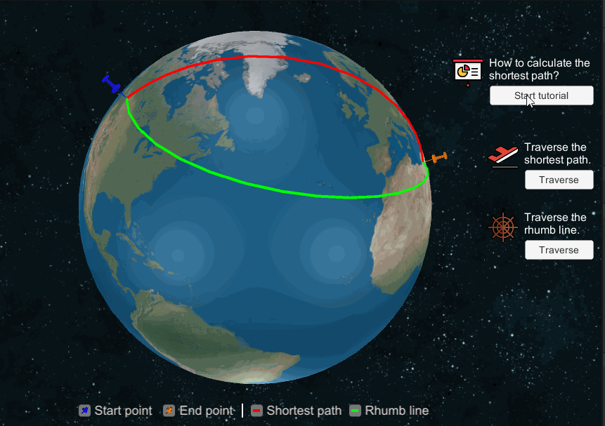

# Shortest-Path-And-Rhumb-Line
This project simulates the generation of shortest paths and rhumb lines between coordinates. It displays the final generated paths on a 2D plane and a 3D sphere. The project is created using Unity3d and provides the following features:

| Setting the start and end coordinates | Displaying the paths on a 2D plane and a 3D sphere | 
| :-----: | :-------: |
|  |  |
| Tutorial on how to compute the shortest path | Traversing the paths |
|  |  |

# Demo


We created a WebGL application that demonstrates different features provided by our simulation.
A complete demo can be found on [https://omaddam.github.io/Shortest-Path-And-Rhumb-Line/](https://omaddam.github.io/Shortest-Path-And-Rhumb-Line/).

# Getting Started

These instructions will get you a copy of the project on your local machine for development and testing purposes.

### Prerequisites

The things you need to install before you proceed with development:

1) [Unity3d (2020.2.0f1)](https://unity3d.com/get-unity/download/archive) [required].

### Installing

A step by step guide to get you started with development.

#### Download, clone, and setup the repository

```git
git clone https://github.com/omaddam/Shortest-Path-And-Rhumb-Line.git
```

#### Initialize git flow

```git
git flow init
```

# Standards

### General Standards

* Line ending: CRLF
* Case styles: Camel, Pascal, and Snake case
  * Arguments, paramters, and local variables: camel case (e.g. shortestPath)
  * Global variables: pascal case (e.g. StartCoordinates)
  * Constants and static variables: snake case (ALL CAPS) (e.g. DEFAULT_COLOR)
* Methods naming convention:
  * Pascal case (e.g. GeneratePath)
  * Verbs

### Commenting Standards

* `///` Summaries: Full-usage of English grammar and punctuation. (e.g. Add periods to the end of your summaries, as if you were writing a phrase or sentence.)
*  `//` In-line comments: quick, point-form. Grammar and punctuation not needed

### Assets / App

* Contains all scripts and resources used in the demo.
* Scripts are created under Assets/App/Scripts folder.

### Third Party Packages

* All packages should be included under Assets/ThirdParty folder.
* Contains all packages downloaded from the Unity3d store.

### Assets / Others

* All components should be included under Assets/\<Name> folder. (e.g. Assets/SphericalPaths)
* Each component should be isolated and under **NO CIRCUMSTANCES** referencing or using another component's scripts.
* Components are **NOT** allowed to reference or call application/demo scripts.

# Code Based Documentation

## Assets / SphericalPaths

This folder contains the implementation of the algorithms that compute the shortest path and the constant path (rhumb line). The algorithms' implementation can be found in the *DataStructure* folder while the rest of the components are for visualization purposes.

### DataStructure

The data structure contains 3 classes.

* **Coordinates**: represents a single point on a map.
  * Properties
    * **CartesianCoordinates**: the latitude and longitude coordinates of the point.
    * **Width**: the width of the 2D plane this point will be presented on. The width is double the height.
    * **PlaneCoordinates**: x and y coordinates normalized and scaled to be displayed on the 2D plane.
    * **Radius**: the radius of the 3D sphere this point will be presented on.
    * **SphericalCoordinates**: x, y, and z coordinates normalized and scaled to be displayed on the 3D sphere.

* **Path**: represents a path on a map.
  * Properties
    * **Coordinates**: list of coordinates sorted in the order that defines the path.
    * **Start**: references the first coordinates in the path.
    * **Last**: references the last coordinates in the path.

* **PathComputationMethods**: a static class that provides extensions and methods to compute paths and bearing angles. We only list some of the methods below.
  * Methods
    * **GetRhumbPath**: generates the path between the two coordinates using rhumb line.
    * **GetShortestPath**: generates the path between the two coordinates using shortest path.
    * **ComputeRhumbPathBearingAngle**: computes the bearing angle at a provided coordinates while facing a target in a direction that follows the rhumb line path.
    * **ComputeShortestPathBearingAngle**: computes the bearing angle at a provided coordinates while facing a target in a direction that follows the shortest path.

### Point

A *Point* represents coordinates on a map in the form of a pin. It is used as a template by the plane and sphere components when displaying the coordinates.
* Prefab: Assets/SphericalPaths/Prefabs/Point.prefab
* Script: Assets/SphericalPaths/Scripts/Point.cs
  * Initialize: sets the color, location, and rotation of the pin.

### Path

A *Path* uses line renderers to represent paths, trails, and projections on a map. It is mainly used as a template by the plane and sphere components when displaying the paths.
* Prefab: Assets/SphericalPaths/Prefabs/Path.prefab
* Script: Assets/SphericalPaths/Scripts/Path.cs
  * Initialize: sets the color and displays lines to connect all the coordinates.

### Plane
### Sphere